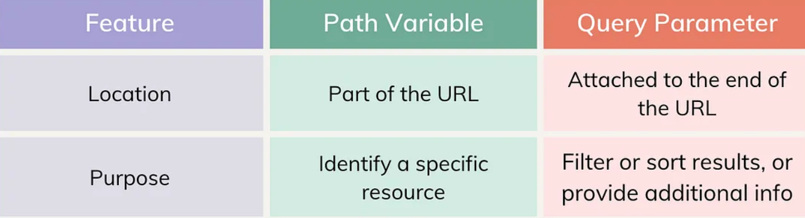

# Angular Routing 🌐

```
Angular routing is a powerful feature that allows you to navigate between different components or modules within your Angular application. It provides a seamless user experience by dynamically updating the content without reloading the entire page
```

## Path vs Query Parameters



- [For more detail, read this Medium article by @AveryCS
  ](https://medium.com/@averydcs/understanding-path-variables-and-query-parameters-in-http-requests-232248b71a8)

# 1. Path Parameters 📍

### 1.1 Passing path parameter in routes:

```
<a [routerLink] = ['book', bookID, 'author', authorID]>
```

```
const routes: Routes = [
    {path: 'books/:boodID/author/:authorID', component: BookComponent}
]
```

### 1.2 Retrieving path parameter from routes:

There are two ways for retrieving the path param from the routes:

- `snapshot` (for static route till the component is active and no change in route)
- `observable` (for dynamic route)

- Using snapshot 📸

```
this.bookIDfromRoutes = this.routes.snapshot.paramMap.get('bookID')
this.bookIDfromRoutes = this.routes.snapshot.params['bookID']
```

- Using observable 📡

```
this.routes.paramMap.subscribe(params => {
    this.bookIDfromRoutes = params.get('bookID')
})

this.routes.params.subscribe(params => {
    this.bookIDfromRoutes = params['bookID']
})
```

# 2. Query Parameters 🔍

### 2.1 Passing query parameter in routes:

```
<a [routerLink] = "['product']" [queryParams]={search: searchValue}>
```

```
const routes: Routes = [
    {path: 'product', component: ProductComponent}
]
```

### 2.2 Retrieving query parameter from routes:

There are two ways for retrieving the path param from the routes:

- `snapshot` (for static route till the component is active and no change in route)
- `observable` (for dynamic route)

- Using snapshot 📸

```
this.product = this.routes.snapshot.queryParamMap.get('search')
this.product = this.routes.snapshot.queryParams['search']
```

- Using observable 📡

```
this.routes.queryParamMap.subscribe(params => {
    this.product = params.get('search')
})

this.routes.queryParams.subscribe(params => {
    this.product = params['search']
})
```

# 3. Lazy Loading 🔁

```
Angular only loads modules as needed, rather than loading all modules when the application launches
```

# 4. Route Guard 🔐

```
Use route guards to prevent users from navigating to parts of an application without authorization
```

### Route guards available are:

### 1. canActivate

> You want to make sure that only logged-in users can access this page. If a user tries to access the "Home" without being logged in, they should be redirected to the "Login" page.

```
// auth.service.ts
import { Injectable } from '@angular/core';

@Injectable({
  providedIn: 'root'
})
export class AuthService {
  private isLoggedIn: boolean = false;

  login() {
    this.isLoggedIn = true;
  }

  logout() {
    this.isLoggedIn = false;
  }

  isAuthenticated(): boolean {
    return this.isLoggedIn;
  }
}

```

```
// auth.guard.ts
import { Injectable } from '@angular/core';
import { CanActivate, Router } from '@angular/router';
import { AuthService } from './auth.service';

@Injectable({
  providedIn: 'root'
})
export class AuthGuard implements CanActivate {

  constructor(private authService: AuthService, private router: Router) {}

  canActivate(): boolean {
    if (this.authService.isAuthenticated()) {
      return true;
    } else {
      // Redirect to the login page
      this.router.navigate(['/login']);
      return false;
    }
  }
}
```

```
{ path: 'dashboard', component: DashboardComponent, canActivate: [AuthGuard] },
```

### 2. canActivateChild

> Let's extend the previous example. Suppose the "Home" has child routes like "Reports" and "Settings," and you want to protect all child routes under "Home" so that only logged-in users can access them.

### 3. canDeactivate

> Used to prevent users from leaving a route without confirmation.

### 4. canMatch

> New feature in Angular that allows you to dynamically determine whether a route should be matched based on custom logic. This guard gives you fine-grained control over route matching, allowing you to include or exclude routes based on certain conditions.

> For example, you might want to restrict access to a "Special Offers" page to only be available on Fridays. You can use the canMatch guard to implement this logic.

### 5. resolve

> Used to pre-fetch data before navigating to a route. It helps ensure that necessary data is available to a component when it is loaded. This is particularly useful for scenarios where you want to ensure that data is available before the component initializes, avoiding issues like components rendering incomplete data or showing loading states.

### 6. canLoad

> Used to control whether a feature module should be loaded or not. This guard is particularly useful for lazy-loaded modules, where you may want to prevent users from loading certain parts of your application based on conditions such as user roles, permissions, or other criteria.
